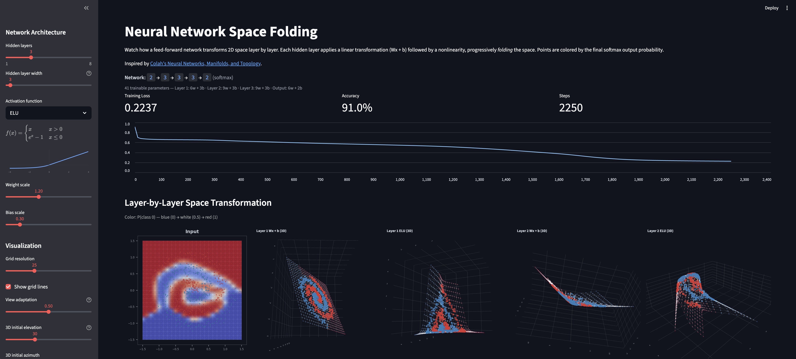

# nnvis

Interactive visualization of how neural networks "fold" space. Watch a feed-forward network transform a 2D grid layer by layer — each linear transformation followed by a nonlinearity progressively warps the input space until the classes become separable.

Inspired by [Neural Networks, Manifolds, and Topology](https://colah.github.io/posts/2014-03-NN-Manifolds-Topology/) by Chris Olah.


<p align="center">
  
</p>

## Features

- **Layer-by-layer space deformation** — see how each `Wx + b` and activation transforms the 2D grid, with gouraud-shaded pcolormesh showing the deformed space colored by class probability
- **Decision boundary heatmap** — dense forward pass over input space showing the learned decision boundary with contour lines
- **Live training animation** — watch the network learn in real time as the decision boundary and space folding evolve during SGD training
- **Configurable architecture** — adjust depth (1-8 hidden layers), width (2-32 neurons), activation function (ReLU, Tanh, Sigmoid, Leaky ReLU, ELU), weight/bias scales, and learning rate
- **3D visualization** — for 3-wide hidden layers, interactive Plotly 3D plots let you drag to rotate, zoom, and pan the transformed space
- **PCA projection** — for layers wider than 3, intermediate representations are projected to 2D via PCA
- **Dataset overlays** — Two Spirals, Concentric Circles, and XOR toy datasets

## Setup

Requires Python 3.14+ and [uv](https://docs.astral.sh/uv/).

```bash
git clone https://github.com/adamhadani/nnvis.git
cd nnvis
uv venv
source .venv/bin/activate
uv pip install -e .
```

## Usage

```bash
source .venv/bin/activate
streamlit run app.py
```

This opens the app in your browser. Use the sidebar to configure the network and visualization:

1. Set the number of hidden layers and their width
2. Pick an activation function
3. Select a dataset overlay (e.g., Two Spirals)
4. Increase training steps and click "Animate training" to watch the network learn

## How It Works

The app builds a feed-forward network with numpy (no ML framework) and visualizes every intermediate representation:

- A 2D grid of points is passed through each layer
- At each stage (pre-activation `Wx + b` and post-activation), the deformed grid is plotted with points colored by the final softmax probability
- Grid lines overlay shows how the original grid structure warps through the network
- Training uses manual backpropagation with SGD, updating weights in-place

For **width=2** layers, the intermediate space is directly plottable as a 2D mesh. For **width=3**, interactive 3D scatter plots preserve all information. For wider layers, PCA projects to 2D for approximate visualization.

## License

MIT
